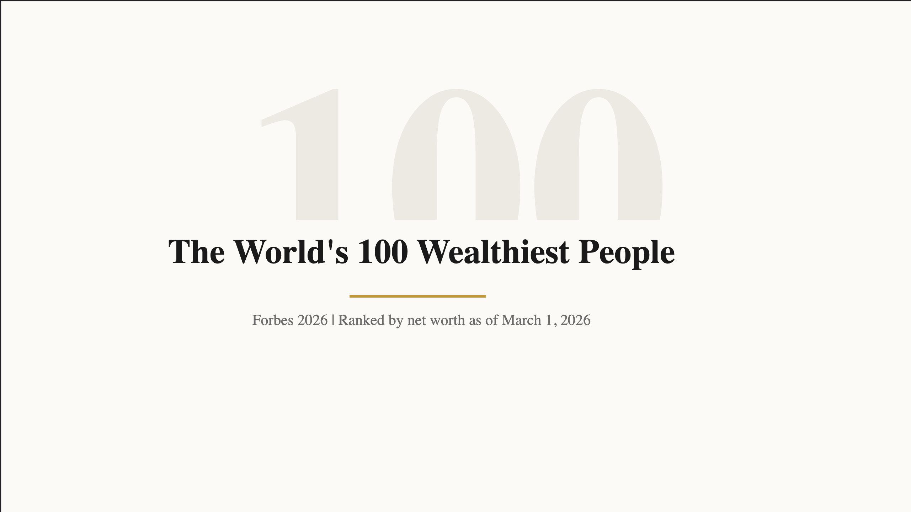
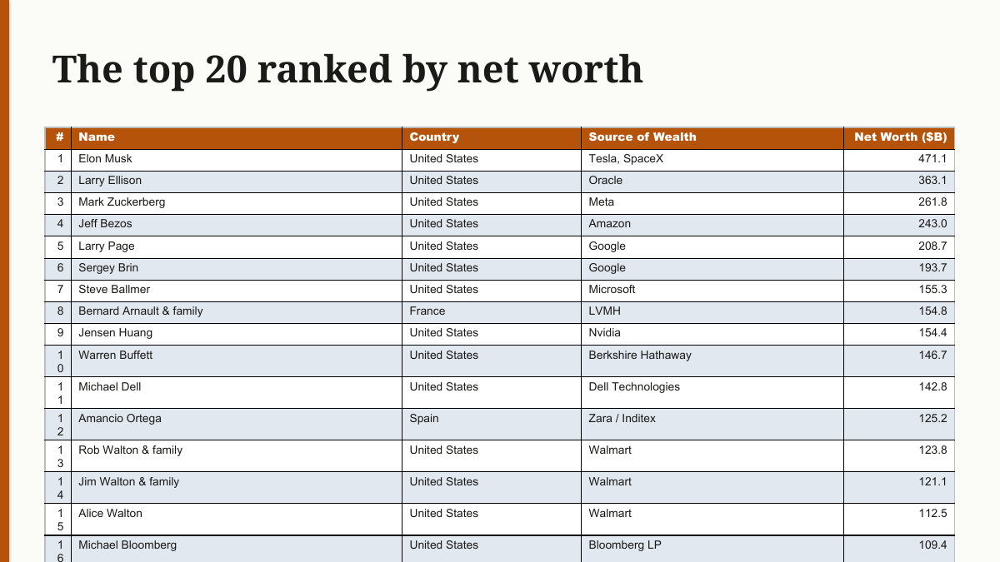
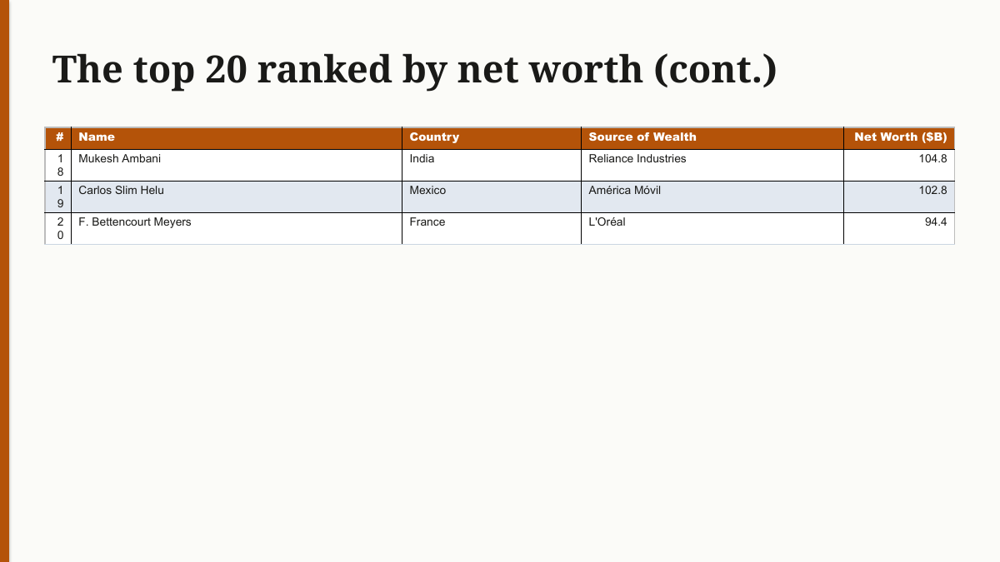
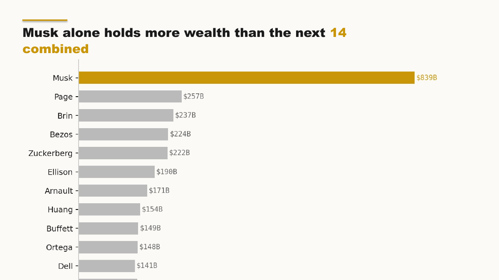

<!--
DRAFT (Claude-written from notes.md in Saad's voice). NOT for autopilot publish.
Per the Post-02 rule: Saad does one real OUT-LOUD voice pass + a defensibility check
before this goes live. Run through voice-profile.md. Zero em-dashes. No employer /
platform / upstream-tool names. Medium version: lists not tables. The 400MB / LibreOffice
claim states the limit exactly, do not over-claim. Every number defensible live.

TITLE options, pick one, kill the rest:
- I built an abstraction so my agent could write documents. Then I deleted it.
- My agent wrote better documents when I gave it more work to do
- The abstraction that made my agent worse at its job
-->

# I built an abstraction so my agent could write documents. Then I deleted it.

So I asked my agent to make a presentation. It made one. Looked fine, clean cover, a few stat slides, a table at the end. Good enough that I didn't look twice.

Then a week later I asked it for a different deck. Different topic, different data, different audience. And the thing it handed back was the same deck. Same cover, same rhythm, same reach for a table at the end to round it off. The words were different but the face was identical.

I didn't catch it the first time, or the second. I caught it when I had a stack of them open side by side and couldn't tell which was which. Nothing was broken. Every one of them was, technically, a document. They just all looked like the same machine made them, because one did, and it had quietly stopped trying.

So the question I had to sit with was, why does everything this agent makes come out wearing the same outfit, and why did it take a whole pile of them before I noticed.

And before anyone beats me to it, yes, the one-line version of this post is that I built an abstraction that turned out to be a mistake, and then I deleted it. I'll own that upfront. The part worth your time isn't the mistake. It's that the mistake was invisible the whole way, it looked exactly like progress, and the obvious fix, making the abstraction better, would have made it worse.

## How I got here

Let me back up, because the sameness wasn't an accident. It was something I built.

Making a real Office document from an agent is not glamorous work. Under the hood it's python-pptx for slides, python-docx for Word, openpyxl for spreadsheets, WeasyPrint for PDFs. Powerful libraries, but low level. If you let the agent drive them raw, every document is a long script, easily five thousand tokens of shape-this-box, set-that-font, merge-these-cells. Slow to generate, expensive, and the agent trips over its own code half the time.

So I did the obvious thing. I wrapped them. A thin helper layer, so the agent could write five lines instead of a five-thousand-token script. Cover, a couple of stat blocks, a table, save. It felt obviously right. Less to generate, less to break, faster every time.

And then I spent a couple of weeks hardening it, because agents go straight for the sharp edges. A few that stuck with me.

The agent kept passing the output path into the wrong argument, the one where the styling was supposed to go, and getting back a NoneType error that told it nothing. So it would thrash, try again, thrash. I fixed it by making the error message name the actual fix instead of dying cryptically. The agent is the user here, and the error message is the documentation.

Another one. It would put forty rows into a table on a single slide, and the bottom twenty-six would run off the edge into nothing. Silent data loss. So I taught the wrapper to auto-split long tables across slides, with a continuation slide each time it overflowed. Remember that one, it comes back.

And WeasyPrint can't render emoji. The agent would drop a rocket into a PDF, get a little tofu box, and then burn four scripts trying to rasterize the emoji into an image to patch it. From the outside it looked like "the PDF takes forever." It wasn't the render, it was the flailing. Fix was simple, no emoji, use a real icon, build the thing once.

Point is, it was working. I thought I was polishing a good tool.

## The diagnosis

Here's what I actually built, and I didn't see it until the decks were lined up next to each other.

There are two things going on here, and the honest order is the less flattering one first. An agent is results-driven. You give it a job, it wants to return a result, and the wrapper produced a document, so the moment a file existed the agent decided it was done. Not a good document, but a document, and that was enough to make it stop. The abstraction handed it an exit ramp, a way to call the job finished before it had done any real thinking.

But I don't want to dress this up as pure agent psychology, because part of it is plainer than that. The wrapper just didn't leave much room. The layout and the palette were baked into the call, so even when the agent might have reached for something better, the easy path only offered it a handful of moves. A cover, some stat blocks, and when in doubt, a table. A low ceiling on what it could customize is a low ceiling on what it could make, and that is the duller, more real half of the story. The agent quitting early and the wrapper boxing it in were the same problem wearing two faces.

Here's the same job through both versions of the tool, a few months apart, a ranking of the world's wealthiest people. The skill and the instructions were identical. The only thing I deliberately changed is whether the wrapper sat in the middle. Even the cover tells you something changed.

But the cover is the easy part. The real story is what each version does with the actual data, the same ranking, when you ask it for the list.

The wrapper pastes the ranking into a table. Twenty rows. It doesn't fit on one slide, so it spills the last three onto a second slide stamped "(cont.)."

That continuation slide is the tell, and it's the part that actually got me. It only exists because I taught the wrapper to auto-split long tables, which at the time I thought was a nice feature. But that feature I was proud of, paginating a long table across slides, was a symptom. The wrapper made "paste the rows" the easy move, so the agent pasted the rows, so I built a thing to tidy up after it pasted the rows. I was automating the cleanup of a mess my own abstraction kept making.

Now the same ranking, same numbers, through the version with no wrapper.

No table. It turned the ranking into a chart, put one bar in the accent color and grayed out the rest, and gave the slide a heading that argues instead of labels. The wrapper called that slide "The top 20 ranked by net worth." This one calls it "Musk alone holds more wealth than the next 14 combined." Same data. One names the topic, the other tells you what to think about it, and that gap is basically the whole post.

And it holds across the deck, not just one slide. The wrapper labels its sections, "THE SCALE," "Country Breakdown," one of them literally just numbered "01." The version without it writes the conclusion every time. Take the wrapper away and the agent stops dumping, because dumping is no longer the easy way out.

## The fix that felt backwards

So I deleted the library.

That was harder than it sounds, and not for any technical reason. I'd spent weeks on that wrapper, and every bug I fixed made it a little more mine. The more I had put into it, the more deleting it felt like setting the work on fire. That is the sunk cost talking, and sunk cost is exactly what keeps you polishing a thing long after you should have killed it. The wrapper worked, in the narrow sense that it ran and produced files, but whether it worked was never the question. The question was what it was quietly costing me, and once I saw that, a better wrapper was not the answer. No wrapper was. So I put the agent back on the raw libraries, the long scripts, all of it.

Not raw and hope, though. Two things took the wrapper's place, and neither of them is code.

First, a design brief the agent has to write before it builds anything. Not slides, a brief. Pick a direction. Pick one type scale and hold to it. Pick an accent color and say why that color for this subject. Prove this document is different from the last one you made. Every heading is a takeaway sentence, not a label. One visual motif, carried all the way through. It has to commit to all of that on paper before it's allowed to open python-pptx.

Second, a recipe book instead of a wrapper. For each format there's a styling guide full of snippets, but the agent is told to adapt them, never paste them. A snippet is a head start. Then it has to change the colors, the sizes, the structure, to art-direct this specific document.

The constraint is the creativity. Taking away the easy path is what forces the agent to make decisions, and decisions are the entire difference between a document and a designed document.

None of this means abstraction is bad. Raw libraries aren't a pure final answer either, and a more powerful abstraction, one that gives the agent real room to customize instead of a handful of presets, could beat both the wrapper and the raw scripts. That is exactly what I'm building toward now. But it doesn't exist yet, and until it does, making the agent do the work by hand is the version that actually produces something worth sending.

## The bill

I'm not going to pretend this was free, because it wasn't.

Tokens went straight back up. Five lines became big scripts again, so every document got more expensive and slower to make. Variance went up too. Docs started coming back broken again, the exact bugs the wrapper used to swallow, the transparent fills, the off-slide tables, all of it back.

So why keep it. Because the creativity came back, and that was the one thing I couldn't buy any other way. A bug is fixable. I can tell the agent what to avoid and it avoids it. Generic-but-working isn't a bug, it's a ceiling, and there's no patch for a ceiling. I'd rather chase fixable problems than ship a tool that's permanently mediocre and cheerful about it.

## Keeping it safe without the crutch

The obvious objection is, fine, but now your output is broken half the time. Right. So how do you get the safety back without re-adding the thing you just deleted.

A review loop, in the same session, not a second agent. The agent builds the document, then reviews its own work, then fixes, then reviews again, and only hands it to the user once it's satisfied. Build, review, fix, repeat.

It reviews two ways. One is structural, a tool that reads the file and flags the mechanical stuff, a broken reference, content spilling off a slide, text too low-contrast to read. That's cheap and it runs on everything. The other is the one that matters more, render-and-look. The agent renders the document to an image and actually looks at it, all the slides at once, the way a person would.

For PDFs that part is easy and it's been live for a while. For Office files it's harder, because a pptx or a docx doesn't turn into a picture on its own. You need LibreOffice in headless mode to convert it first, then rasterize that. I've run it, it works fine. The catch is LibreOffice is about four hundred megabytes in the image, and that's a lot of weight to carry for one review step. So right now it's a fallback, not the default, and I'm still looking for a lighter way to get the same look.

Which means I should be straight about it. On a deck today, the taste check is the brief plus a careful structural pass, not the agent looking at a rendered picture of its own work. The picture is where I want this to go, it just isn't there for Office files yet. Better to tell you exactly where that line sits than pretend the agent eyeballs every deck before it ships, because it doesn't.

And the bugs the wrapper used to prevent, those moved too. Instead of code that stops the agent from overflowing a table, there's a list of pitfalls I'd actually hit, handed to the agent up front. Here are the mistakes, stay clear of them. The hard-won fixes went from living in the library to living in the agent's instructions.

## What this is really about

This is bigger than documents.

Abstraction removes work. That's the whole point of it, and for a person it's almost always a win, you hide the boring part and get on with the interesting part. But an agent doesn't sort work into boring and interesting. It sorts work into done and not-done. So when you abstract away the hard part, you're not freeing the agent to think, you're deleting the place where it had to. You hand it an easy win, it takes the easy win, and it calls the job finished.

That's how you get mediocrity that reports success. Not a broken agent, a satisfied one, handing you the same soulless deck over and over and genuinely believing it did the work.

So sometimes the move is the opposite of what it looks like. You make the agent better by giving it the harder version of the job on purpose. Don't abstract away the part where it has to think, because that part was the job.

<!-- POST-WRITE CHECKLIST (before publish):
[ ] Saad out-loud voice pass, run through voice-profile.md (this is a Claude draft, not yours yet)
[ ] grep for em-dashes, must be zero
[ ] no employer / platform / upstream-tool names (python-pptx etc are public libs, fine)
[ ] both cover images render; Medium version uses lists not tables
[ ] the 400MB / LibreOffice claim still states the limit exactly, no over-claim
[ ] every number defensible live (400MB, "next fourteen combined", "twenty-row table")
[ ] write devto.md version + cover, log to WORKLOG.md, update feedback-log.md after comments
-->
